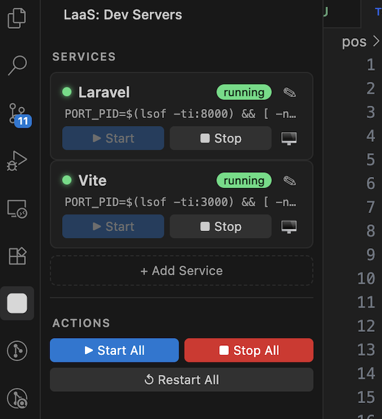
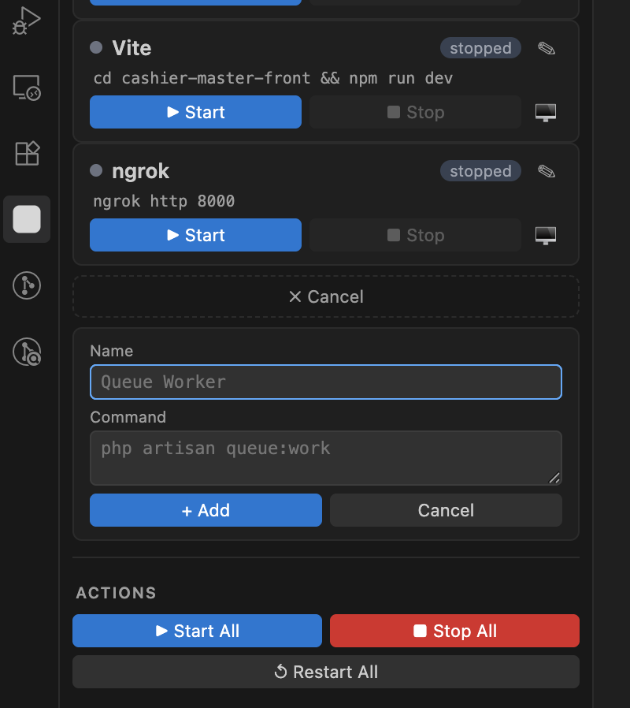
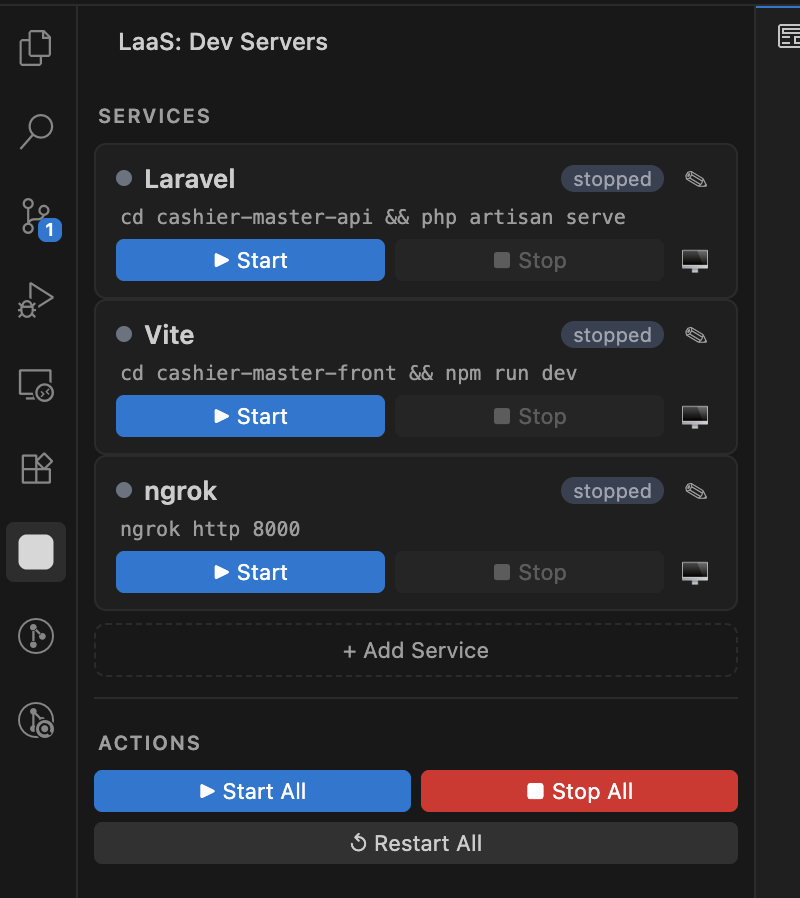

# LaaS

**Lazy as a Service - If you have to do it twice, it should probably become a button.**

LaaS is a VS Code / Antigravity-compatible extension that gives you a **sidebar panel** and status bar buttons to start, stop, and inspect your local dev stack. Laravel, Vite, ngrok or whatever you want with your CMD.

## 🚀 Why LaaS?

Because opening 5 terminal tabs every single day like some kind of ritual is not productivity, it is **developer cardio**.

Modern dev setups love chaos:
- one terminal for Laravel
- one for Vite
- one for ngrok
- one for queues
- one more because something crashed and now you are “just checking”

LaaS saves you from terminal tab babysitting.

Instead of manually summoning your dev stack like a sleep-deprived wizard, LaaS turns it into a clean little dashboard where your commands live, run, and behave themselves.
Less clicking. Less typing. Less “wait which tab was Vite again?” More pure, refined laziness.



### The "Help" of this Extension:

* **Eliminate Redundant Coding:** Instead of re-typing long one-liners or searching through your `.zshrc` history, save your complex commands as a service once.
* **Headless Background Management:** Commands run in independent **Pseudoterminals**. You can close your terminal panel, work on your code, and your services stay alive in the background until you hit "Stop."
* **Unified Environment:** No more "Terminal Hunting." One sidebar, one status bar, and one-click "Start All" to fire up your entire project ecosystem.
* **Custom Cleanup:** Traditional terminals just "kill" a process. LaaS allows you to define **Custom Stop Commands** (e.g., `valet stop`, `docker-compose down`) to ensure your environment is cleaned up properly.
* **Developer Sandbox:** Need to run an FTP sync script that watches for changes? Add it as a service. Need a local AI agent running in the background? Add it as a service. If it runs in a CMD, it belongs in LaaS.

---

### How it changes your workflow:

| Before LaaS | After LaaS |
| --- | --- |
| Opening 4 terminal tabs manually. | Click **"Start All"** from the Status Bar. |
| Hunting for the "Vite" tab to check for errors. | Click the **"View Logs"** icon on the Vite card. |
| Leaving ghost processes running after closing VS Code. | Graceful **Stop Commands** clean up your stack. |
| Forgetting that one complex shell one-liner. | It's saved in your **Service Editor** for good. |

---

## Features

- **Sidebar panel** in the Activity Bar with per-service cards:
  - 🟢 Live status indicator (green = running, grey = stopped)
  - ▶ Start / ■ Stop buttons per service
- **Status bar buttons** — Start All, Stop All, Show Output
- Separate named terminals for each service

## Default commands

| Service | Default command |
|---------|----------------|
| Laravel | `php artisan serve` |
| Vite    | `npm run dev` |
| ngrok   | `ngrok http 8000` |

## Extension settings

| Setting | Description | Default |
|---------|-------------|---------|
| `laas.laravelCommand` | Command to start Laravel | `php artisan serve` |
| `laas.viteCommand` | Command to start Vite | `npm run dev` |
| `laas.ngrokCommand` | Command to start ngrok | `ngrok http 8000` |
| `laas.autoShowOnStart` | Focus terminal on start | `false` |
| `laas.statusBarAlignment` | `"left"` or `"right"` | `"left"` |

 

## Example settings.json

```json
{
  "laas.laravelCommand": "php -d xdebug.mode=debug artisan serve",
  "laas.viteCommand": "npm run dev",
  "laas.ngrokCommand": "ngrok http 8000",
  "laas.autoShowOnStart": false,
  "laas.statusBarAlignment": "left"
}

```

 

